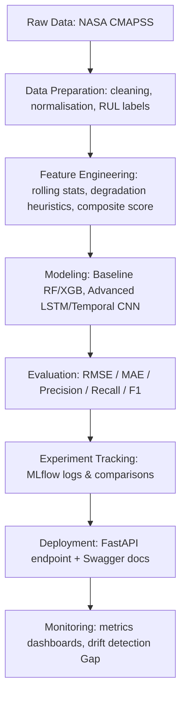

# Predictive Maintenance with NASA CMAPSS Dataset

## Project Overview
This project develops a predictive maintenance solution for jet engines using the NASA CMAPSS (Commercial Modular Aero-Propulsion System Simulation) dataset.  
The objective is to predict the **Remaining Useful Life (RUL)** of engines from multivariate sensor data and demonstrate a full **end-to-end ML workflow**.

This project is designed to be portfolio-ready and highlight skills across:
- Exploratory Data Analysis (EDA) and feature engineering  
- ML model development (regression + classification)  
- Reproducibility, versioning, and modular code organisation  
- Experiment tracking and reporting  
- Deployment-ready architecture (FastAPI, testing, CI/CD ready)

---

## Goals
- Understand engine degradation through sensor behavior analysis  
- Engineer labels for **RUL prediction** and **failure classification**  
- Benchmark baseline models and compare with advanced ML methods  
- Build a clean, reproducible pipeline suitable for deployment  
- Demonstrate good MLOps practices (experiment tracking, modular repo, testing)

---

Project Structure
------------

    ## Project Organisation

    predictive_maintenance
    ├── LICENSE                           <- Project license
    ├── Makefile                          <- Convenience commands for data processing and model training
    ├── README.md                          <- Project overview and instructions
    ├── data
    │   ├── cleaned                        <- Cleaned & labeled datasets ready for feature engineering
    │   ├── external                       <- Any external/third-party data
    │   ├── features                       <- Engineered feature CSVs for training/testing
    │   ├── interim                        <- Intermediate processing outputs
    │   ├── processed                      <- Final canonical datasets (train/test/RUL/predictions)
    │   └── raw                            <- Original unprocessed NASA CMAPSS data + documentation
    ├── docs                               <- Sphinx documentation source
    ├── models                             <- Serialized/trained models (e.g., Random Forest, LightGBM)
    ├── notebooks                          <- Jupyter notebooks (EDA, feature engineering, prototyping)
    ├── references                          <- Reference materials (PDFs, manuals, notes)
    ├── reports
    │   ├── EDA_report.html                <- Generated exploratory analysis report
    │   └── figures                        <- Figures for reports/dashboards
    ├── requirements.txt                   <- Python dependencies
    ├── setup.py                           <- Project setup for pip installable module
    ├── src                                <- Core project code
    │   ├── __init__.py
    │   ├── app
    │   │   ├── app_api.py                 <- FastAPI endpoint for predictions
    │   │   └── app_dashboard.py           <- Streamlit dashboard logic
    │   ├── data
    │   │   └── make_dataset.py            <- Scripts for data ingestion and cleaning
    │   ├── features
    │   │   ├── driver_health_indicators.py
    │   │   ├── engineer_health_indicators.py
    │   │   └── generate_failure_labels.py
    │   ├── models
    │   │   ├── train_model.py
    │   │   ├── predict_model.py
    │   │   ├── train_model_lightgbm.py
    │   │   ├── train_model_xgb.py
    │   │   └── log_top_model.py
    │   └── visualization
    │       └── visualize.py
    ├── tests                              <- Unit tests with pytest
    │   ├── test_generate_health_indicators.py
    │   └── test_generate_labels.py
    ├── test_environment.py                <- Script to validate Python environment setup
    └── tox.ini                             <- Testing automation configuration

--------
## Workflow Overview

--------

## End-to-End Workflow

The pipeline is organised as follows:

1. **Data Ingestion**
   - Source: NASA CMAPSS FD001 dataset
   - Files: [insert filenames or location here]
   - Notes: [insert preprocessing notes here]

2. **Data Preparation**
   - Tasks:
     - Handle missing values
     - Normalize sensor readings
     - Generate RUL labels
   - Output: `/data/processed/train_processed.csv`, `/data/processed/test_processed.csv`

3. **Feature Engineering**
   - Implemented:
     - Rolling window statistics (mean, std, min, max)
     - Degradation threshold heuristic (e.g., 75%)
     - Composite health score
   - Output: `/data/processed/features.csv`
   - *(Gap: insert final feature list here)*

4. **Model Development**
   - Baseline Models: [insert e.g. Linear Regression, Random Forest]
   - Advanced Models: [insert e.g. LSTM, Temporal CNN]
   - Training scripts: `src/models/train_model.py`
   - Prediction scripts: `src/models/predict_model.py`
   - *(Gap: insert actual models and hyperparameters here)*

5. **Evaluation**
   - Regression Metrics: RMSE, MAE → *(Gap: insert scores)*
   - Classification Metrics: Precision, Recall, F1 → *(Gap: insert scores/confusion matrix)*
   - Visualisations: see `/reports/figures/`
   - *(Gap: insert sample plots here)*

6. **Experiment Tracking**
   - Tool: MLflow
   - Parameters, metrics, and artefacts logged
   - Example Run ID: *(Gap: paste example MLflow run link/screenshot)*

7. **Deployment (Prototype)**
   - Framework: FastAPI
   - Endpoints:
     - `/predict` → takes in sensor data JSON
     - `/health` → service health check
   - Swagger UI available at `/docs`
   - *(Gap: paste screenshot or curl command demo)*

8. **Monitoring & Next Steps**
   - Planned:
     - Model drift detection
     - Dashboard integration (Streamlit/Plotly)
     - CI/CD pipeline for automated retraining
   - *(Gap: future work items here)*

<small>Project based on the <a target="_blank" href="https://drivendata.github.io/cookiecutter-data-science/">cookiecutter data science project template</a>. #cookiecutterdatascience</small>

