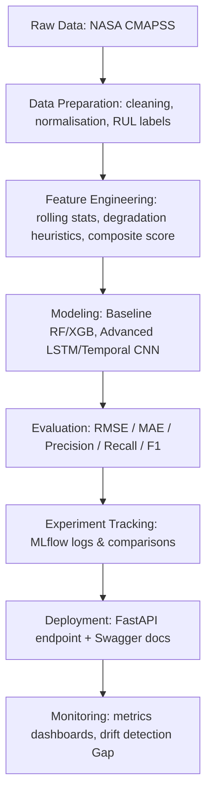

# Predictive Maintenance with NASA CMAPSS Dataset

## Project Overview
This project develops a predictive maintenance solution for jet engines using the NASA CMAPSS (Commercial Modular Aero-Propulsion System Simulation) dataset.  
The objective is to predict the **Remaining Useful Life (RUL)** of engines from multivariate sensor data and demonstrate a full **end-to-end ML workflow**.

This project is designed to be portfolio-ready and highlight skills across:
- Exploratory Data Analysis (EDA) and feature engineering  
- ML model development (regression + classification)  
- Reproducibility, versioning, and modular code organisation  
- Experiment tracking and reporting  
- Deployment-ready architecture (FastAPI, testing, CI/CD ready)

---

## Goals
- Understand engine degradation through sensor behavior analysis  
- Engineer labels for **RUL prediction** and **failure classification**  
- Benchmark baseline models and compare with advanced ML methods  
- Build a clean, reproducible pipeline suitable for deployment  
- Demonstrate good MLOps practices (experiment tracking, modular repo, testing)

---

Project Structure
------------

    ├── LICENSE
    ├── Makefile           <- Makefile with commands like `make data` or `make train`
    ├── README.md          <- The top-level README for developers using this project.
    ├── data
    │   ├── cleaned        <- Cleaned and preprocessed data ready for feature engineering and modeling.
    │   ├── external       <- Data from third party sources.
    │   ├── interim        <- Intermediate data that has been transformed.
    │   ├── processed      <- The final, canonical data sets for modeling.
    │   └── raw            <- The original, immutable data dump.
    │
    ├── docs               <- A default Sphinx project; see sphinx-doc.org for details
    │
    ├── models             <- Trained and serialized models, model predictions, or model summaries
    │
    ├── notebooks          <- Jupyter notebooks. Naming convention is a number (for ordering),
    │                         the creator's initials, and a short `-` delimited description, e.g.
    │                         `1.0-jqp-initial-data-exploration`.
    │
    ├── references         <- Data dictionaries, manuals, and all other explanatory materials.
    │
    ├── reports            <- Generated analysis as HTML, PDF, LaTeX, etc.
    │   └── figures        <- Generated graphics and figures to be used in reporting
    │
    ├── requirements.txt   <- The requirements file for reproducing the analysis environment, e.g.
    │                         generated with `pip freeze > requirements.txt`
    │
    ├── setup.py           <- Makes project pip installable (pip install -e .) so src can be imported
    ├── src                <- Source code for use in this project.
    │   ├── __init__.py    <- Makes src a Python module
    │   │
    │   ├── data           <- Scripts to download or generate data
    │   │   └── make_dataset.py
    │   │
    │   ├── features       <- Scripts to turn raw or cleaned data into features for modeling
    │   │   └── build_features.py
    │   │
    │   ├── models         <- Scripts to train models and then use trained models to make
    │   │   │                 predictions
    │   │   ├── predict_model.py
    │   │   └── train_model.py
    │   │
    │   └── visualization  <- Scripts to create exploratory and results oriented visualizations
    │       └── visualize.py
    │
    └── tox.ini            <- tox file with settings for running tox; see tox.readthedocs.io

--------
## Workflow Overview

--------

## End-to-End Workflow

The pipeline is organised as follows:

1. **Data Ingestion**
   - Source: NASA CMAPSS FD001 dataset
   - Files: [insert filenames or location here]
   - Notes: [insert preprocessing notes here]

2. **Data Preparation**
   - Tasks:
     - Handle missing values
     - Normalize sensor readings
     - Generate RUL labels
   - Output: `/data/processed/train_processed.csv`, `/data/processed/test_processed.csv`

3. **Feature Engineering**
   - Implemented:
     - Rolling window statistics (mean, std, min, max)
     - Degradation threshold heuristic (e.g., 75%)
     - Composite health score
   - Output: `/data/processed/features.csv`
   - *(Gap: insert final feature list here)*

4. **Model Development**
   - Baseline Models: [insert e.g. Linear Regression, Random Forest]
   - Advanced Models: [insert e.g. LSTM, Temporal CNN]
   - Training scripts: `src/models/train_model.py`
   - Prediction scripts: `src/models/predict_model.py`
   - *(Gap: insert actual models and hyperparameters here)*

5. **Evaluation**
   - Regression Metrics: RMSE, MAE → *(Gap: insert scores)*
   - Classification Metrics: Precision, Recall, F1 → *(Gap: insert scores/confusion matrix)*
   - Visualisations: see `/reports/figures/`
   - *(Gap: insert sample plots here)*

6. **Experiment Tracking**
   - Tool: MLflow
   - Parameters, metrics, and artefacts logged
   - Example Run ID: *(Gap: paste example MLflow run link/screenshot)*

7. **Deployment (Prototype)**
   - Framework: FastAPI
   - Endpoints:
     - `/predict` → takes in sensor data JSON
     - `/health` → service health check
   - Swagger UI available at `/docs`
   - *(Gap: paste screenshot or curl command demo)*

8. **Monitoring & Next Steps**
   - Planned:
     - Model drift detection
     - Dashboard integration (Streamlit/Plotly)
     - CI/CD pipeline for automated retraining
   - *(Gap: future work items here)*

<small>Project based on the <a target="_blank" href="https://drivendata.github.io/cookiecutter-data-science/">cookiecutter data science project template</a>. #cookiecutterdatascience</small>

