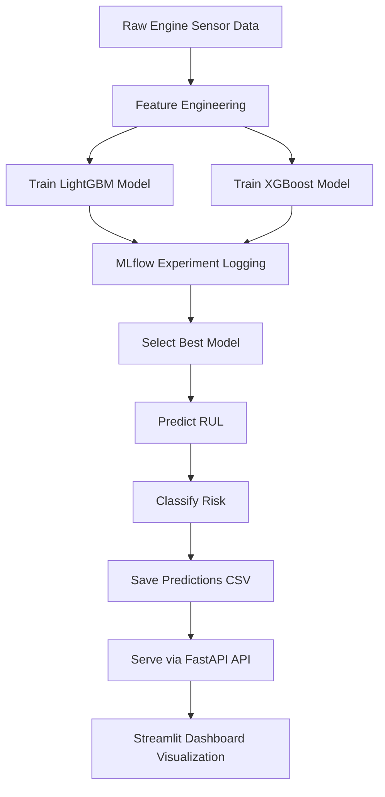

# Predictive Maintenance with NASA CMAPSS Dataset

## Project Overview
This project develops a predictive maintenance solution for jet engines using the NASA CMAPSS (Commercial Modular Aero-Propulsion System Simulation) dataset.  
The objective is to predict the **Remaining Useful Life (RUL)** of engines from multivariate sensor data and demonstrate a full **end-to-end ML workflow**.

This project is designed to be portfolio-ready and highlight skills across:
- Exploratory Data Analysis (EDA) and feature engineering  
- ML model development (regression + classification)  
- Reproducibility, versioning, and modular code organisation  
- Experiment tracking and reporting  
- Deployment-ready architecture (FastAPI, testing, CI/CD ready)

---

## Goals
- Understand engine degradation through sensor behavior analysis  
- Engineer labels for **RUL prediction** and **failure classification**  
- Benchmark baseline models and compare with advanced ML methods  
- Build a clean, reproducible pipeline suitable for deployment  
- Demonstrate good MLOps practices (experiment tracking, modular repo, testing)

---

Project Structure
------------

    ## Project Organisation

    predictive_maintenance
    ├── LICENSE                           <- Project license
    ├── Makefile                          <- Convenience commands for data processing and model training
    ├── README.md                          <- Project overview and instructions
    ├── data
    │   ├── cleaned                        <- Cleaned & labeled datasets ready for feature engineering
    │   ├── external                       <- Any external/third-party data
    │   ├── features                       <- Engineered feature CSVs for training/testing
    │   ├── interim                        <- Intermediate processing outputs
    │   ├── processed                      <- Final canonical datasets (train/test/RUL/predictions)
    │   └── raw                            <- Original unprocessed NASA CMAPSS data + documentation
    ├── docs                               <- Sphinx documentation source
    ├── models                             <- Serialized/trained models (e.g., Random Forest, LightGBM)
    ├── notebooks                          <- Jupyter notebooks (EDA, feature engineering, prototyping)
    ├── references                          <- Reference materials (PDFs, manuals, notes)
    ├── reports
    │   ├── EDA_report.html                <- Generated exploratory analysis report
    │   └── figures                        <- Figures for reports/dashboards
    ├── requirements.txt                   <- Python dependencies
    ├── setup.py                           <- Project setup for pip installable module
    ├── src                                <- Core project code
    │   ├── __init__.py
    │   ├── app
    │   │   ├── app_api.py                 <- FastAPI endpoint for predictions
    │   │   └── app_dashboard.py           <- Streamlit dashboard logic
    │   ├── data
    │   │   └── make_dataset.py            <- Scripts for data ingestion and cleaning
    │   ├── features
    │   │   ├── driver_health_indicators.py
    │   │   ├── engineer_health_indicators.py
    │   │   └── generate_failure_labels.py
    │   ├── models
    │   │   ├── train_model.py
    │   │   ├── predict_model.py
    │   │   ├── train_model_lightgbm.py
    │   │   ├── train_model_xgb.py
    │   │   └── log_top_model.py
    │   └── visualization
    │       └── visualize.py
    ├── tests                              <- Unit tests with pytest
    │   ├── test_generate_health_indicators.py
    │   └── test_generate_labels.py
    ├── test_environment.py                <- Script to validate Python environment setup
    └── tox.ini                             <- Testing automation configuration


--------
## Workflow Overview

--------

## MLflow Experiment Tracking

Experiments are tracked using MLflow. Key experiments include:

FD001 RUL LightGBM Hyperparam Tuning

FD001 RUL XGBoost Hyperparam Tuning

FD001 RUL Hyperparam Tuning (baseline)

All training scripts log metrics, parameters, feature importance, and models to MLflow.

--------

## Training Scripts
**train_model_lightgbm.py**

Trains LightGBM models with random hyperparameter search.

Logs metrics (MAE, RMSE, R2, Max Error) to MLflow.

Saves feature importances and columns.

Example metrics logging snippet:
```python
mlflow.log_metric("MAE", mae)
mlflow.log_metric("RMSE", rmse)
mlflow.log_metric("R2", r2)
mlflow.log_metric("Max Error", max_err)
```
**train_model_xgb.py**

Trains XGBoost models with random hyperparameter search.

Logs similar metrics to MLflow.

--------

## Inference
**predict_model.py**

Loads the best model from MLflow.

Predicts RUL for test data.

Classifies risk: High (<30 cycles), Medium (<100 cycles), Low (≥100 cycles).

Logs inference run and predictions to MLflow.

Saves predictions CSV in **data/processed/rul_predictions.csv**.

Saves feature importances for analysis.

--------

## Top Model Comparison
**log_top_model.py**

Fetches the best run from each experiment.

Compares models based on MAE, RMSE, R2, Max Error.

Visualizes comparison using Seaborn barplots.

--------

## API
**app/app_api.py**

FastAPI service exposing endpoints:

| End Point  | Description  |
|------------|--------------|
| GET /    | Health check        |
| GET /predictions     | All RUL predictions      |
| GET /predictions/{id}     | Single unit RUL prediction      |

Can be expanded to accept raw sensor input and return predictions.

Swagger UI available at **http://127.0.0.1:8000/docs**.

--------

## Streamlit Dashboard
**app/app_dashboard.py**

Interactive dashboard displaying:

- Engine sensor trends

- RUL predictions & risk levels

- Unit-level analysis and comparison with true RUL

Tabs include:

- Summary

- Overview

- Individual Unit Analysis

- RUL Predictions

Cached loading for faster performance using **@st.cache_data**.

--------

## Risk Classification

| Risk Level | RUL (cycles) |
|------------|--------------|
| High       | < 30         |
| Medium     | 30–100       |
| Low        | ≥ 100        |

--------

## Usage
### Run MLflow server
```python
mlflow ui --backend-store-uri sqlite:///mlflow.db --port 5000
```
### Train Models
```python
python scripts/train_model_lightgbm.py
python scripts/train_model_xgb.py
```
### Run Predictions
```python
python scripts/predict_model.py
```
### Start API
```python
uvicorn app.app_api:app --reload
```
### Launch Dashboard
```python
streamlit run app/app_dashboard.py
```
### Dependencies

Install dependencies from **requirements.txt**:
```python
pip install -r requirements.txt
```
Key packages:

- pandas, numpy

- scikit-learn, xgboost, lightgbm

- mlflow

- streamlit, plotly

- fastapi, pydantic, uvicorn

<p><small>Project based on the <a target="_blank" href="https://drivendata.github.io/cookiecutter-data-science/">cookiecutter data science project template</a>. #cookiecutterdatascience</small></p>
