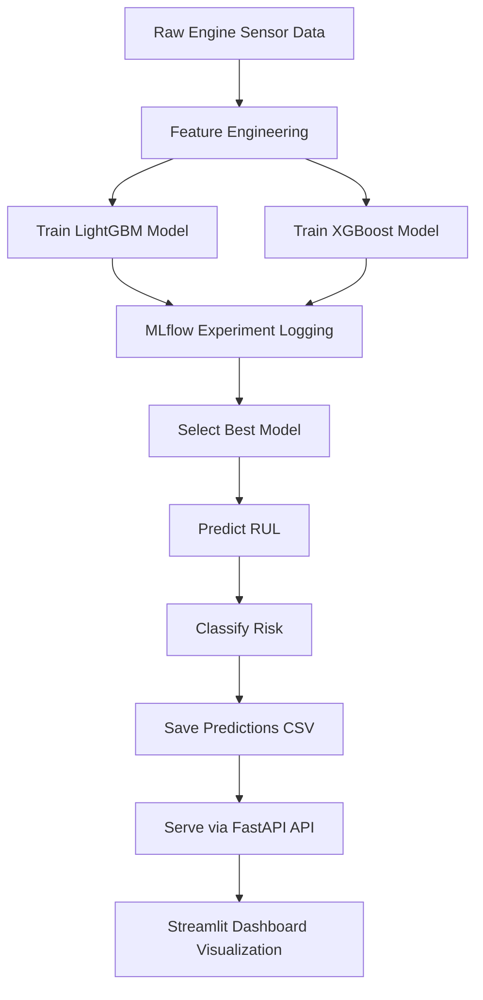

# Predictive Maintenance with NASA CMAPSS Dataset

## Project Overview
This project develops a predictive maintenance solution for jet engines using the NASA CMAPSS (Commercial Modular Aero-Propulsion System Simulation) dataset.  
The objective is to predict the **Remaining Useful Life (RUL)** of engines from multivariate sensor data and demonstrate a full **end-to-end ML workflow**.

This project is designed to be portfolio-ready and highlight skills across:
- Exploratory Data Analysis (EDA) and feature engineering  
- ML model development (regression + classification)  
- Reproducibility, versioning, and modular code organisation  
- Experiment tracking and reporting  
- Deployment-ready architecture (FastAPI, testing, CI/CD ready)

---

## Goals
- Understand engine degradation through sensor behavior analysis  
- Engineer labels for **RUL prediction** and **failure classification**  
- Benchmark baseline models and compare with advanced ML methods  
- Build a clean, reproducible pipeline suitable for deployment  
- Demonstrate good MLOps practices (experiment tracking, modular repo, testing)

---

Project Structure
------------

    ## Project Organisation

    predictive_maintenance
    ├── CLAUDE.md                          <- Guidance for Claude Code when working in this repo
    ├── DECISIONS.md                       <- Decision log (one short entry per approved change)
    ├── LICENSE                            <- Project license
    ├── Makefile                           <- Convenience commands (data, lint, clean, backup-mlflow)
    ├── README.md                          <- Project overview and instructions
    ├── docker-compose.yml                 <- Mosquitto MQTT broker for the streaming simulation
    ├── docker
    │   └── mosquitto
    │       └── mosquitto.conf             <- Broker configuration
    ├── data
    │   ├── cleaned                        <- Cleaned & labeled datasets ready for feature engineering
    │   ├── external                       <- Any external/third-party data
    │   ├── features                       <- Engineered feature CSVs for training/testing
    │   ├── interim                        <- Intermediate processing outputs
    │   ├── processed                      <- Final canonical datasets (train/test/RUL/predictions)
    │   ├── raw                            <- Original unprocessed NASA CMAPSS data + documentation
    │   └── stream                         <- SQLite state for the streaming consumer (created at runtime)
    ├── docs                               <- Sphinx documentation source
    ├── models                             <- Serialized/trained models (e.g., Random Forest, LightGBM)
    ├── notebooks                          <- Jupyter notebooks (EDA, feature engineering, prototyping)
    ├── references                         <- Reference materials (PDFs, manuals, notes)
    ├── reports
    │   ├── EDA_report.html                <- Generated exploratory analysis report
    │   └── figures                        <- Figures for reports/dashboards
    ├── pytest.ini                         <- pytest configuration (puts src on the path)
    ├── requirements.txt                   <- Python dependencies
    ├── setup.py                           <- Project setup for pip installable module
    ├── src                                <- Core project code
    │   ├── __init__.py
    │   ├── backup_mlflow.py               <- Snapshots mlflow.db into backups/ with a timestamped name
    │   ├── app
    │   │   ├── app_api.py                 <- FastAPI endpoint for predictions
    │   │   ├── app_dashboard.py           <- Streamlit dashboard logic
    │   │   ├── stream_gateway.py          <- MQTT-to-WebSocket bridge mounted on the API
    │   │   └── static
    │   │       └── live.html              <- Live view page served at /live
    │   ├── data
    │   │   └── make_dataset.py            <- Scripts for data ingestion and cleaning
    │   ├── features
    │   │   ├── driver_health_indicators.py
    │   │   ├── engineer_health_indicators.py
    │   │   └── generate_failure_labels.py
    │   ├── models
    │   │   ├── train_model.py
    │   │   ├── predict_model.py
    │   │   ├── train_model_lightgbm.py
    │   │   ├── train_model_xgb.py
    │   │   └── log_top_model.py
    │   ├── streaming                      <- Real-time streaming simulation
    │   │   ├── config.py                  <- Broker, topic and path settings
    │   │   ├── producer.py                <- Replays the test set as MQTT telemetry
    │   │   ├── consumer.py                <- Computes features and predictions per micro-batch
    │   │   ├── state_store.py             <- SQLite store for streamed readings
    │   │   ├── stream_features.py         <- Reuses the batch feature engineering on each engine's history
    │   │   └── run_all.py                 <- Starts and stops all streaming services with one command
    │   └── visualization
    │       └── visualize.py
    ├── tests                              <- Unit tests with pytest
    │   ├── conftest.py
    │   ├── test_generate_health_indicators.py
    │   ├── test_generate_labels.py
    │   ├── test_reproducibility.py
    │   ├── test_run_all.py
    │   ├── test_stream_consumer.py
    │   ├── test_stream_features.py
    │   ├── test_stream_gateway.py
    │   ├── test_stream_producer.py
    │   └── test_stream_state_store.py
    ├── test_environment.py                <- Script to validate Python environment setup
    └── tox.ini                            <- Testing automation configuration


--------
## Workflow Overview

```mermaid
flowchart TD
    A[Raw Engine Sensor Data] --> B[Feature Engineering]
    B --> C[Train LightGBM Model]
    B --> D[Train XGBoost Model]
    C --> E[MLflow Experiment Logging]
    D --> E
    E --> F[Select Best Model]
    F --> G[Predict RUL]
    G --> H[Classify Risk]
    H --> I[Save Predictions CSV]
    I --> J[Serve via FastAPI API]
    J --> K[Streamlit Dashboard Visualization]
```
--------

## MLflow Experiment Tracking

Experiments are tracked using MLflow. Key experiments include:

FD001 RUL LightGBM Hyperparam Tuning (unit split, seeded)

FD001 RUL XGBoost Hyperparam Tuning (unit split, seeded)

FD001 RUL Hyperparam Tuning (unit split, seeded) (Random Forest baseline)

FD001 RUL Inference (test-set evaluation of the selected model)

All training scripts log metrics, parameters, feature importance, and models to MLflow.

Older experiments are kept for history only. The ones with no suffix used a random row-level split, so their metrics are not comparable (see Evaluation Methodology). The "(unit split)" ones used an unseeded hyperparameter search and cannot be reproduced exactly.

--------

## Training Scripts
**train_model_lightgbm.py**

Trains LightGBM models with random hyperparameter search.

Logs metrics (MAE, RMSE, R2, Max Error) to MLflow.

Saves feature importances and columns.

Example metrics logging snippet:
```python
mlflow.log_metric("MAE", mae)
mlflow.log_metric("RMSE", rmse)
mlflow.log_metric("R2", r2)
mlflow.log_metric("Max Error", max_err)
```
**train_model_xgb.py**

Trains XGBoost models with random hyperparameter search.

Logs similar metrics to MLflow.

--------

## Inference
**predict_model.py**

Loads the best model from MLflow.

Predicts RUL for test data.

Classifies risk: High (<30 cycles), Medium (<100 cycles), Low (≥100 cycles).

Logs inference run and predictions to MLflow.

Saves predictions CSV in **data/processed/rul_predictions.csv**.

Saves feature importances for analysis.

Evaluates the predictions against the ground truth (see below) and logs test_MAE, test_RMSE and test_R2 to the inference run.

--------

## Evaluation Methodology

### Validation split: grouped by engine (changed from a random split)
Each training script holds out 20% of the training data to compare hyperparameters and select the best model.

- **Previously:** the hold-out was a random 80/20 split of *rows* (`train_test_split`). Each row is one cycle of one engine, so neighbouring cycles of the same engine ended up in both the training and validation sets. The per-engine baseline features (`<sensor>_baseline`) made this worse, because they act as a fingerprint that identifies the engine. The model could effectively interpolate within an engine it had already seen, and the validation scores were far too optimistic (best: XGBoost RMSE 11.6, MAE 7.6, R² 0.97).
- **Now:** the hold-out is split by engine (`GroupShuffleSplit` grouped on `unit`), so validation engines are never seen during training. This matches the real use case, which is predicting RUL for an engine the model has never seen. Runs using this split are logged to the experiments with the "(unit split, seeded)" suffix, and `predict_model.py` selects only from those.

### Reproducibility: seeded hyperparameter search
Each training script defines a single `SEED = 42`. It drives the grouped validation split, the random hyperparameter search (a local `random.Random(SEED)`, in place of the global unseeded `random.choice` used before) and each model's `random_state`. Retraining from scratch therefore produces the same runs, the same selected model and the same metrics, and each run logs `search_seed` to MLflow. Changing `SEED` also changes the validation split. `tests/test_reproducibility.py` fails if any unseeded random call or splitter without `random_state` is added under `src/`.

### Test-set evaluation: ground truth from RUL_FD001
The CMAPSS test engines are cut off at an unknown point before failure, and `RUL_FD001.txt` gives the true RUL remaining at each engine's last observed cycle. Test labels are therefore `RUL = (last observed cycle − current cycle) + RUL_FD001[unit]`. The headline test metric follows the standard CMAPSS protocol: each engine's prediction at its last observed cycle is compared with RUL_FD001, across 100 engines.

(Before this fix, test labels were computed as if each engine failed at its last observed cycle, and the dashboard compared predictions against the RUL of a *training* engine with the same unit number.)

### Current results (FD001)
Each row is the best run by validation RMSE (the metric `predict_model.py` selects on) from the seeded search (`SEED = 42`).

| Model | Validation (unit split, all cycles) | Test (last cycle vs RUL_FD001) |
|---|---|---|
| Random Forest (selected) | RMSE 28.2, MAE 19.8, R² 0.82 | **RMSE 25.0, MAE 18.3, R² 0.64** |
| XGBoost | RMSE 29.1, MAE 21.6, R² 0.80 | — |
| LightGBM | RMSE 30.9, MAE 22.0, R² 0.78 | — |
| *Previous Random Forest (unit split, unseeded search)* | *RMSE 28.2* | *RMSE 24.4, MAE 18.2, R² 0.66 (not reproducible)* |
| *Previous XGBoost (random split)* | *RMSE 11.6, MAE 7.6, R² 0.97 (leaky)* | *RMSE 27.3, MAE 19.9* |

Validation and test numbers measure different things. Validation covers every cycle of the held-out engines, including early-life cycles where RUL is large and hard to predict, while the test figure covers only the last observed cycle. RUL targets are not capped, so these results are not directly comparable with published FD001 results that clip RUL at about 125 cycles.

--------

## Top Model Comparison
**log_top_model.py**

Fetches the best run from each experiment.

Compares models based on MAE, RMSE, R2, Max Error.

Visualizes comparison using Seaborn barplots.

--------

## API
**src/app/app_api.py**

FastAPI service exposing endpoints:

| End Point  | Description  |
|------------|--------------|
| GET /    | Health check        |
| GET /predictions     | All RUL predictions      |
| GET /predictions/{id}     | Single unit RUL prediction      |

Can be expanded to accept raw sensor input and return predictions.

Swagger UI available at **http://127.0.0.1:8000/docs**.

--------

## Streamlit Dashboard
**src/app/app_dashboard.py**

Interactive dashboard displaying:

- Engine sensor trends

- RUL predictions & risk levels

- Unit-level analysis and comparison with true RUL

Tabs include:

- Summary

- Overview

- Individual Unit Analysis

- RUL Predictions

- Commercial Analysis

- Live (real-time streaming predictions; see Real-time Streaming Simulation below)

Cached loading for faster performance using **@st.cache_data**.

--------

## Risk Classification

| Risk Level | RUL (cycles) |
|------------|--------------|
| High       | < 30         |
| Medium     | 30–100       |
| Low        | ≥ 100        |

--------

## Usage
### Run MLflow server
```bash
mlflow ui --backend-store-uri sqlite:///mlflow.db --port 5000
```
### Train Models
```bash
python src/models/train_model.py
python src/models/train_model_lightgbm.py
python src/models/train_model_xgb.py
```
### Run Predictions
```bash
python src/models/predict_model.py
```
### Start API
```bash
uvicorn src.app.app_api:app --reload
```
### Launch Dashboard
```bash
streamlit run src/app/app_dashboard.py
```
### Real-time Streaming Simulation
Replays the test set as live MQTT telemetry, one reading per engine per cycle. Features and RUL predictions are computed incrementally and pushed to the dashboard's **Live** tab over WebSocket.

One command starts the broker, MLflow (if it isn't already running), the consumer, the API gateway and the dashboard, in that order. It waits for each service to report ready before starting the next, and one Ctrl+C stops everything it started. Output is labelled per service and also written to `logs/<service>.log`:
```bash
PYTHONPATH=src python src/streaming/run_all.py                   # needs Docker Desktop
```
Then start a replay in a second terminal. The producer refuses to start until the consumer reports online:
```bash
PYTHONPATH=src python src/streaming/producer.py --interval 0.2   # replay (--keep-history, --stagger, --units)
```
To run the services by hand instead: `docker compose up -d`, the MLflow server, `PYTHONPATH=src python src/streaming/consumer.py` (wait for its "published online status" line), then `uvicorn src.app.app_api:app` and the dashboard. `http://127.0.0.1:8000/stream/status` shows whether the gateway is connected to the broker and how many messages it has received and forwarded.
### Dependencies

Install dependencies from **requirements.txt**:
```bash
pip install -r requirements.txt
```
Key packages:

- pandas, numpy

- scikit-learn, xgboost, lightgbm

- mlflow

- streamlit, plotly

- fastapi, pydantic, uvicorn

<p><small>Project based on the <a target="_blank" href="https://drivendata.github.io/cookiecutter-data-science/">cookiecutter data science project template</a>. #cookiecutterdatascience</small></p>
